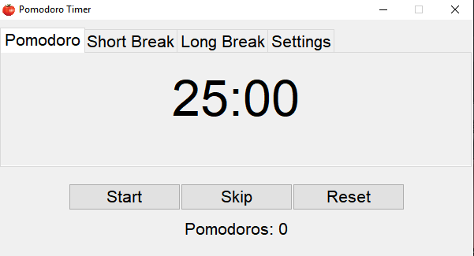
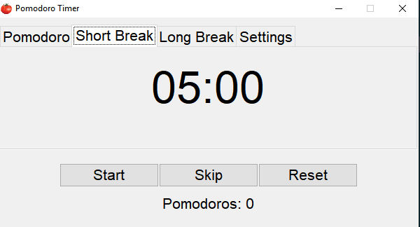
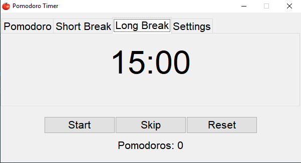
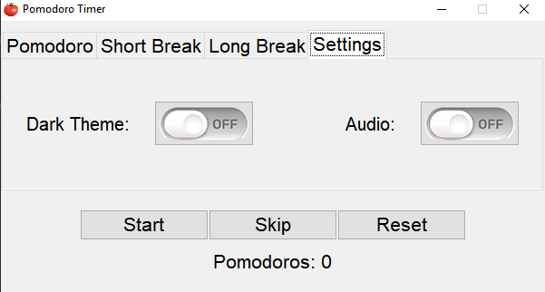
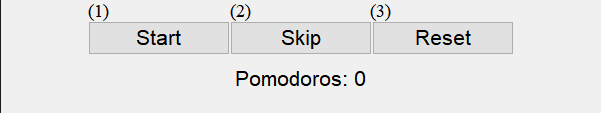
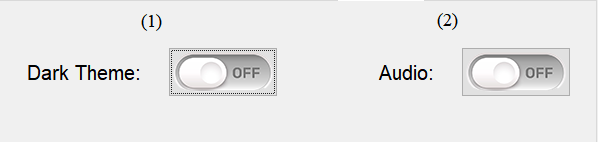
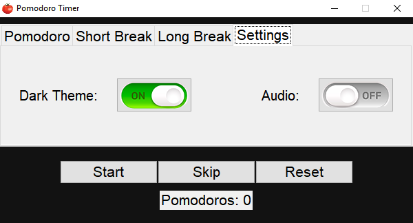
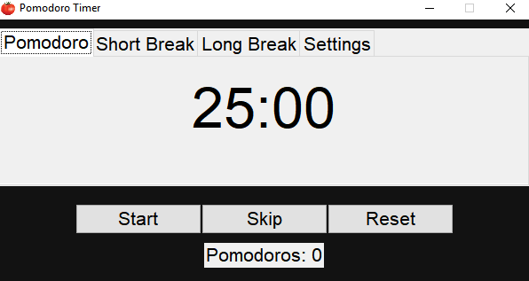

# Pomodoro Timer

## 1. What is a Pomodoro Timer?

> Pomodoro Timer is an application that can help you study much easier than usual. It's based on the ***[Pomodoro Technique](https://todoist.com/productivity-methods/pomodoro-technique)*** - a time management method for efficient work. For ```1 hour and 15 minutes```, you have ***2 work sessions*** for ```25 minutes``` each, ***2 short breaks*** - for ```5 minutes``` each, and ***1 long break*** - for ```15 minutes```.

## 2. UI (User Interface)

> This application has **4** tabs, **1** Pomodoros counter (You make 1 Pomodoro when a Pomodoro timer ends), **3** main, and **2** setting buttons. 

### 2.1. Tabs

> 1. **``Pomodoro``** - There is located a 25-minute timer for one work session.
>
>
>    

> 2. **``Short Break``** - There is located a 5-minute timer for one short break.
>
>
>    

> 3. **``Long Break``** - There is located a 15-minute timer for one long break.
>
>
>    

> 4. **``Settings``** - There are 2 option buttons - one for the application's appearance (color theme) and one for audio.
>
>
>    

### 2.2. Buttons

> a) **Main Buttons** - With these buttons, you have control over the timers.
>
> 1. **``Start``** - Starts the 25-minute Pomodoro timer **(1)**
> 1. **``Skip``** - Skips a timer **(2)**
> 1. **``Reset``** - Resets every timer **(3)**
>
>
>    

> b) **Setting Buttons** - With these buttons, you can customize this app by your choice.
>
> 1. **``Dark Theme``** - toggles the app's appearance **(1)**
> 1. **``Audio``** - toggles the app's audio **(2)**
>
>
>    

### 2.3. Themes

> 1. **``Dark Theme``**
>
>    
>
>    

> 2. **``White Theme``**
>
>    
>
>    

## 3. Modules

### Programming Language: **Python 3.10.1** :snake:

> | **Module Name**  | **Version** | **Usage** |
> | :-------------: |:----------------------------------------:| :----------:|
> | ``tkinter`` | **Standart module** | *Creates the application* |
> | ``threading`` | **Standart module** | *It makes it possible to access the UI while a timer is on* |
> | ``time`` | **Standart module** | *Used sleep() function* |
> | ``pygame`` | **2.1.2** | *Sound mixer* |
> | ``json`` | **Standart module** | *Operates with the application's data* |